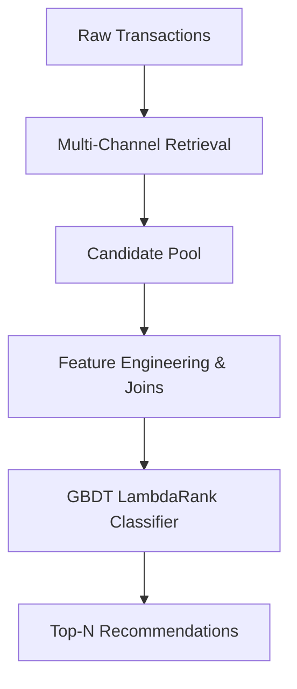

# Technical Framework: Time-Aware Two-Stage Recommender System

This document outlines the high-level technical framework for a two-stage recommendation system optimized for time-aware, multi-location transaction data. It describes the mathematical concepts, candidate generation channels, and feature engineering structures while omitting proprietary hyperparameter bounds to protect implementation specifics.

---

## 1. System Architecture

The recommendation engine is designed as a **Two-Stage Retrieval and Ranking Pipeline**:

1. **Stage 1 (Retrieval Funnel):** Aggregates high-recall candidates from multiple heuristic and collaborative filtering sources, reducing the item catalog to a manageable candidate pool per user.
2. **Stage 2 (Tabular Ranking):** Merges multi-dimensional user, item, and interaction features and trains a Gradient Boosted Decision Tree (GBDT) model to optimize list-wise ranking.

---

## 2. Stage 1: Candidate Retrieval (Recall Optimization)

The retrieval stage gathers candidates from six distinct, non-overlapping channels to ensure a balance of history, popularity, and discovery:

* **Global Bestsellers:** Top-selling items across the entire catalog within a short temporal window to capture active global trends and handle cold-start discovery.
* **Regional Assortment (Local Heroes):** Top-selling items filtered by the user's primary store location, capturing localized inventory variations and store-specific consumer behaviors.
* **User Purchase History:** Re-entry of unique items previously purchased by the user to capture direct replenishment habits.
* **Predictive Replenishment:** Identifies expected repurchase dates by calculating the median temporal gap between sequential purchases for repeat-heavy consumables. Candidates are triggered when the elapsed time matches the calculated cycle.
* **Latent Collaborative Filtering (SVD):** Applies matrix factorization (Singular Value Decomposition) to the sparse user-item transaction matrix. User and item latent vectors are projected into a shared dimensional space to compute affinity scores via inner product:
  $$\text{Score}(u, i) = \mathbf{u} \cdot \mathbf{v}^T$$
* **Item-to-Item (I2I) Cosine Similarity:** Computes co-occurrence similarities from a column-normalized transaction matrix to recommend items structurally similar to the user's historical purchases:
  $$\text{Similarity}(i_1, i_2) = \cos(\theta) = \frac{\mathbf{v}_1 \cdot \mathbf{v}_2}{\|\mathbf{v}_1\| \|\mathbf{v}_2\|}$$
* **Anchor Category Pop:** Identifies the user's primary category L1 by volume and retrieves the highest-velocity items in that specific category globally.

---

## 3. Stage 2: Feature Engineering (33 features)

Once candidates are compiled, they are joined against 33 engineered features grouped into four relational dimensions:

### A. Customer Profile Features
* **Volume Metrics:** Total unique items purchased, total transaction unit quantity.
* **Economic Indicators:** Average historical basket price, price standard deviation (budget vs. premium sensitivity proxy).
* **Exploration Dynamics:** Exploration ratio (ratio of unique item IDs to total purchase volume) and category diversity indices.
* **Category Specialization (Category HHI):** Computes Herfindahl-Hirschman Index (HHI) over the user's category volume distribution to separate highly focused shoppers from multi-category browsers.
* **Developmental Cohort Proxy:** Estimates the developmental age bracket of the shopper's child using historical size-mapped purchases.

### B. Product Profile Features
* **Velocity Metrics:** Global unique users, total units sold.
* **Distribution Index:** Count of unique physical locations stocking the product (catalog fragmentation indicator).
* **Reference Pricing:** Median transactional price.
* **Staple Index:** Customer repeat purchase rate (ratio of repeat buyers to unique buyers).

### C. Interaction Features (User-Item Matching)
* **Direct Interaction:** Recency (days elapsed since last purchase of the item) and historical quantity purchased.
* **Affinity Alignments:** Mismatches or matches between the candidate item's brand/category and the user's dominant brand/category.
* **Economic Bracket Ratio:** Ratio of candidate item price to the customer's average purchase price.
* **Regional Assortment Check:** Total historical sales of the candidate item at the user's primary store location.
* **Temporal Momentum:** Velocity drift index comparing short-term sales velocity against long-term averages to isolate trending products.
* **Developmental Age Delta:** Mathematical difference and ratio between the candidate item's size-age proxy and the customer's child developmental age proxy to filter out size-growth anomalies.
* **Discretionary Repeat Penalty:** Flags non-consumable discretionary categories (e.g., fashion, accessories, toys) where repeat purchases of the exact same item suffer from heavy fatigue, allowing the model to demote redundant repeats.
* **Local Sparsity Penalty:** Flags items in high-sparsity, localized categories that have zero sales at the customer's primary store location, preventing the recommendation of local "Ghost SKUs."

### D. Relational Categorical Identifiers
* Integer physical index mappings for item categories (Levels 1–3) and brands to enable high-efficiency categorical processing.

---

## 4. Model Training & Validation Framework

### Temporal Folds Configuration
To prevent temporal data leakage, validation is structured using sequential time-aware splits. The model is trained strictly on historical transactions up to Month $T$ and evaluated on transactions in Month $T+1$:

* **Fold 1:** Train $\le \text{Month } 8$ $\rightarrow$ Validate $\text{Month } 9$
* **Fold 2:** Train $\le \text{Month } 9$ $\rightarrow$ Validate $\text{Month } 10$
* **Fold 3:** Train $\le \text{Month } 10$ $\rightarrow$ Validate $\text{Month } 11$
* **Final Model:** Train $\le \text{Month } 11$ $\rightarrow$ Evaluate $\text{Month } 12$

### GBDT Ranker Configuration
* **Algorithm:** LightGBM LambdaRank (`objective: lambdarank`)
* **Evaluation Loss:** Normalized Discounted Cumulative Gain (`metric: ndcg` evaluated at position 10) to optimize the list-wise ordering of the final Top-10 slots.
* **Hyperparameter Tuning:** Automated Bayesian Search (via Optuna) to optimize decision tree parameters (leaves, depth, data constraints, and regularization limits).
