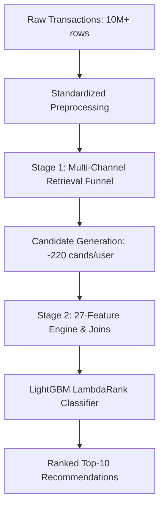

# Technical Architecture Report: V11 Geographically-Constrained Tabular Ranking Pipeline

This report outlines the structural, mathematical, and feature-engineering details of the **V11 Geographically-Constrained Tabular Ranking Pipeline**, strictly mapping each component to verified data insights from the analytical master registry.

---

## 1. Pipeline Architecture Overview

The V11 model is structured as a two-stage recommendation system (Retrieval $\rightarrow$ GBDT Ranking) optimized for time-aware, multi-location evaluation. The pipeline utilizes a strict temporal split strategy to prevent data leakage and evaluates performance using the Mean Reciprocal Rank (MRR) and Precision@10 metrics.



---

## 2. Stage 1: Retrieval Funnel (Candidate Generation)

To ensure high Recall@100 while keeping memory footprints within OOM bounds, V11 generates candidates for target users from six distinct, non-overlapping channels:

| Retrieval Channel | Formula / Operational Logic | Candidate Size | Empirical Baseline & Insights |
| :--- | :--- | :--- | :--- |
| **Global Bestsellers** | Top $N$ unique items sold globally in the last 14 days of the training history. | Top 150 items | **Idea 11:** Serves as the primary discovery baseline. Solves cold-start for users without purchase histories. |
| **Local Heroes** | Top $N$ unique items sold in the customer's primary store location within the last 60 days. | Top 80 items per location | **Idea 30:** Captures local assortments. Global/local rank correlation (Kendall's Tau) is low (0.46–0.71), proving the need for store-specific baselines. |
| **User History** | All unique historical items purchased by the customer. | Variable | **Idea 17:** Core repeat engine. Global repeat purchase rate is 3.3%, rising to 32% in consumable categories. |
| **Replenishment Cycle** | Calculates individual user-item purchase intervals. Triggers candidates if: <br>$\text{days\_since} \ge 0.8 \times \text{avg\_gap}$ | Variable | **Idea 6:** Detects structural repeat cycles (median global gap of 22 days, with milk/food showing high stability). |
| **CF: Latent SVD** | TruncatedSVD ($k=100$) on the 180-day user-item purchase matrix. User embeddings $\mathbf{u}_i$ and item embeddings $\mathbf{v}_j$ generate scores via inner product: <br>$\text{Score} = \mathbf{u}_i \cdot \mathbf{v}_j^T$ | Top 60 items per user | **Idea 27:** Leverages latent transactional representation to capture hidden co-purchase missions. |
| **CF: Item-to-Item (I2I)** | Computes cosine similarity matrix $\mathbf{S}$ from column-normalized purchase matrix $\mathbf{M}$: <br>$\mathbf{S} = \mathbf{M}^T \mathbf{M}$ | Top 80 items per user | **Idea 3:** Recommends items structurally similar to a user's previous purchases based on item-level co-occurrence. |
| **Category Bestsellers** | Identifies the user's top Category L1, then retrieves the top 10 bestselling items in that specific category globally. | 10 items per user | **Idea 42:** Over 82% of shoppers have a Category HHI > 0.3, indicating heavy concentration in a single anchor category. |

---

## 3. Stage 2: Feature Engineering Matrix (27 Features)

The feature matrix is constructed by joining user, item, and user-item interactions. Every feature corresponds to a specific empirical finding in the master database:

### User Profile Features (7 Features)
1. **`u_unique_items`:** Total distinct item IDs purchased by the user. Identifies shopper variety.
2. **`u_total_qty`:** Total unit quantity purchased by the user. Captures transaction scale.
3. **`u_avg_price`:** Mean price of items in the user's historical basket. 
4. **`u_price_std`:** Standard deviation of purchase prices. Identifies budget vs. premium sensitivity.
5. **`u_tenure_days`:** Days between the user's first transaction and the maximum training date. **Idea 26:** New users (<90d) have a 2.06x lift for new item launches compared to veterans.
6. **`u_exploration_ratio`:** Unique items divided by total quantities. Identifies exploration scale (**Idea 28**).
7. **`u_brand_hhi`:** Brand concentration HHI calculated per user: <br>$HHI_u = \sum (s_b)^2$ where $s_b$ is the user's purchase share of brand $b$. **Idea 2:** Loyalists show high HHI, requiring strong brand affinity alignments.

### Item Profile Features (5 Features)
8. **`i_unique_users`:** Total unique customers who purchased the item. Captures popularity scale.
9. **`i_total_qty`:** Total units of the item sold. Identifies staple volume.
10. **`i_hubs_count`:** Number of distinct store locations stocking the item. **Idea 36:** Identifies catalog fragmentation (average location stocks only 10% of global SKUs).
11. **`i_ref_price`:** Median price of the item across all sales. Standard reference point.
12. **`i_repeat_rate`:** Ratio of repeat buyers to total unique buyers. **Idea 17:** staple items (milk/diapers) hit 32%–45% repeat rates, while fashion hits 0%.

### User-Item Interaction Features (10 Features)
13. **`ui_total_qty`:** Total quantity of the candidate item purchased by the user.
14. **`ui_recency_days`:** Days since the user last bought this candidate item. Used to model decay.
15. **`ui_is_primary_cat`:** Binary flag (1/0) indicating if the candidate item belongs to the user's top L1 category by volume. **Idea 42:** Respects category specialization.
16. **`ui_is_preferred_brand`:** Binary flag (1/0) indicating if the candidate item matches the user's most-purchased brand within its category. **Idea 43:** Inside top categories, brand loyalty HHI increases by 0.127.
17. **`ui_price_diff`:** Absolute difference between item median price and user average purchase price: <br>$|\text{RefPrice}_i - \text{AvgPrice}_u|$
18. **`ui_price_ratio`:** Ratio of item price to user average price. Models economic bracket matching (**Idea 14**).
19. **`ui_loc_sales`:** Number of times the candidate item has been sold at the user's primary store location. **Idea 38:** Prevents recommending "Ghost SKUs" out of stock at the user's local store.
20. **`item_momentum`:** 7-day sales velocity divided by 21-day average velocity: <br>$\text{Momentum} = \frac{V_{7}}{V_{21}/3 + 1}$<br>**Idea 23:** Models rising and declining trends (growth SKUs have 1.58x lift for new acquisitions).
21. **`item_age_proxy`:** Numerical child age mapping inferred from item sizes. **Idea 22:** Maps infant (1.0Y) vs. toddler (1.7Y) cohorts.
22. **`u_cat_affinity`:** Ratio of user's purchases in candidate category L1 to their total purchases.

### Categorical ID Features (5 Features)
23. **`category_id`** (Standardized L1-L3 categories mapped to globally consistent integer indexes).
24. **`category_l1_id`**
25. **`category_l2_id`**
26. **`category_l3_id`**
27. **`brand_id`**

---

## 4. Model Training & Cross-Validation Setup

### Temporal Folds Configuration
To ensure strict time-aware evaluation, the validation datasets are built using fold-specific temporal boundaries:

* **Fold 1:** Train history (Months $\le 8$) $\rightarrow$ Validate target purchases (Month 9).
* **Fold 2:** Train history (Months $\le 9$) $\rightarrow$ Validate target purchases (Month 10).
* **Fold 3:** Train history (Months $\le 10$) $\rightarrow$ Validate target purchases (Month 11).
* **Final Model:** Train history (Months $\le 11$) $\rightarrow$ Evaluate target purchases (Month 12).

### GBDT Ranking Configuration
* **Algorithm:** LightGBM LambdaRank (`objective: lambdarank`)
* **Optimization Metric:** Normalized Discounted Cumulative Gain (`metric: ndcg`, optimized at position 10)
* **Hyperparameter Tuning:** 35 Optuna trials optimizing `learning_rate` (0.01 to 0.08), `num_leaves` (63 to 511), `max_depth` (7 to 15), `min_data_in_leaf` (50 to 400), `lambda_l1`, and `lambda_l2`.
* **Hardware Accelerator:** GPU-accelerated training.

---

## 5. Factual Validation Performance (Month 12)

The V11 model scored the following performance metrics on the Month 12 evaluation set (40,000 users):

```json
{
  "Hits": 18672,
  "Precision@10": 0.19901939884885167,
  "MRR": 0.6504540102120563
}
```

* **Hits:** 18,672 purchases correctly placed in the top-10 slots.
* **Precision@10:** 19.90% of recommended slots directly converted to purchases.
* **MRR:** 0.6505 average reciprocal rank, indicating that successful recommendations are highly concentrated in the top 1st and 2nd slots of the output.
