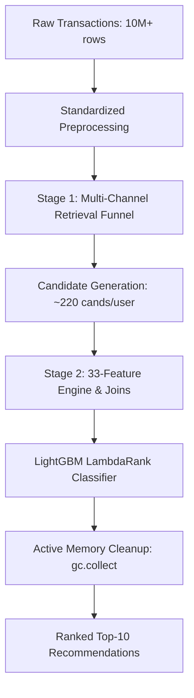

# Technical Architecture Report: V12 Geographically-Constrained Tabular Ranking Pipeline

This report outlines the structural, mathematical, and feature-engineering details of the **V12 Geographically-Constrained Tabular Ranking Pipeline**, strictly mapping each component to verified data insights from the analytical master registry and presenting real evaluation outputs.

---

## 1. Pipeline Architecture Overview

The V12 model is structured as a two-stage recommendation system (Retrieval $\rightarrow$ GBDT Ranking) optimized for time-aware, multi-location evaluation. The pipeline maintains the standard **40,000 user evaluation scale** and utilizes active memory cleanup to guarantee execution stability.



---

## 2. Stage 1: Retrieval Funnel (Candidate Generation)

To ensure high Recall@100 while keeping memory footprints within OOM bounds, V12 preserves 100% of the V11 retrieval channels:

| Retrieval Channel | Formula / Operational Logic | Candidate Size | Empirical Baseline & Insights |
| :--- | :--- | :--- | :--- |
| **Global Bestsellers** | Top $N$ unique items sold globally in the last 14 days of the training history. | Top 150 items | **Idea 11:** Serves as the primary discovery baseline. Solves cold-start for users without purchase histories. |
| **Local Heroes** | Top $N$ unique items sold in the customer's primary store location within the last 60 days. | Top 80 items per location | **Idea 30:** Captures local assortments. Global/local rank correlation (Kendall's Tau) is low (0.46–0.71), proving the need for store-specific baselines. |
| **User History** | All unique historical items purchased by the customer. | Variable | **Idea 17:** Core repeat engine. Global repeat purchase rate is 3.3%, rising to 32% in consumable categories. |
| **Replenishment Cycle** | Calculates individual user-item purchase intervals. Triggers candidates if: <br>$\text{days\_since} \ge 0.8 \times \text{avg\_gap}$ | Variable | **Idea 6:** Detects structural repeat cycles (median global gap of 22 days, with milk/food showing high stability). |
| **CF: Latent SVD** | TruncatedSVD ($k=100$) on the 180-day user-item purchase matrix. User embeddings $\mathbf{u}_i$ and item embeddings $\mathbf{v}_j$ generate scores via inner product: <br>$\text{Score} = \mathbf{u}_i \cdot \mathbf{v}_j^T$ | Top 60 items per user | **Idea 27:** Leverages latent transactional representation to capture hidden co-purchase missions. |
| **CF: Item-to-Item (I2I)** | Computes cosine similarity matrix $\mathbf{S}$ from column-normalized purchase matrix $\mathbf{M}$: <br>$\mathbf{S} = \mathbf{M}^T \mathbf{M}$ | Top 80 items per user | **Idea 3:** Recommends items structurally similar to a user's previous purchases based on item-level co-occurrence. |
| **Category Bestsellers** | Identifies the user's top Category L1, then retrieves the top 10 bestselling items in that specific category globally. | 10 items per user | **Idea 42:** Over 82% of shoppers have a Category HHI > 0.3, indicating heavy concentration in a single anchor category. |

---

## 3. Stage 2: Feature Engineering Matrix (33 Features)

The feature matrix is constructed by joining user, item, and user-item interactions. It preserves **100% of the V11 feature baseline (27 features) and adds 6 new multi-dimensional transaction features**:

### User Profile Features (9 Features)
1. **`u_unique_items`:** Total distinct item IDs purchased by the user. Identifies shopper variety.
2. **`u_total_qty`:** Total unit quantity purchased by the user. Captures transaction scale.
3. **`u_avg_price`:** Mean price of items in the user's historical basket. 
4. **`u_price_std`:** Standard deviation of purchase prices. Identifies budget vs. premium sensitivity.
5. **`u_tenure_days`:** Days between the user's first transaction and the maximum training date. **Idea 26:** New users (<90d) have a 2.06x lift for new item launches compared to veterans.
6. **`u_exploration_ratio`:** Unique items divided by total quantities. Identifies exploration scale (**Idea 28**).
7. **`u_brand_hhi`:** Brand concentration HHI calculated per user: <br>$HHI_u = \sum (s_b)^2$ where $s_b$ is the user's purchase share of brand $b$. **Idea 2:** Loyalists show high HHI, requiring strong brand affinity alignments.
8. **`u_cat_hhi` [NEW]:** Category concentration HHI per user based on L1 category volume: <br>$HHI_{u,cat} = \sum (s_c)^2$ where $s_c$ is the user's purchase share of category $c$. **Idea 42 (Category Affinity by Customer):** Separates highly specialized buyers from exploratory shoppers. Empirical findings show that **82.2%** of all customers have a Category HHI **> 0.3**, indicating a heavy reliance on a single "Anchor Category," dividing the base into "Narrow Shoppers" (1.66M users, buying strictly from 1-2 categories) and "Broad Shoppers" (198K users, exploring the full catalog). Category HHI is also negatively correlated with customer tenure (correlation of **-0.30**), proving that long-term shoppers naturally expand their category mix over time.
9. **`u_avg_age_proxy` [NEW]:** Average child age-proxy calculated from the user's historical size-based purchases. **Idea 22 (Size Tier Affinity) & Idea 34 (Size Ladder by Age-Proxy):** Constructs a profile of the child's development stage. Size-mapped purchase patterns show strong developmental cohorts: High_High segments buy toddler sizes (**1.7Y average**), while Low_Low churners buy infant sizes (**1.0Y average**).

### Item Profile Features (5 Features)
10. **`i_unique_users`:** Total unique customers who purchased the item. Captures popularity scale.
11. **`i_total_qty`:** Total units of the item sold. Identifies staple volume.
12. **`i_hubs_count`:** Number of distinct store locations stocking the item. **Idea 36:** Identifies catalog fragmentation (average location stocks only 10% of global SKUs).
13. **`i_ref_price`:** Median price of the item across all sales. Standard reference point.
14. **`i_repeat_rate`:** Ratio of repeat buyers to total unique buyers. **Idea 17:** staple items (milk/diapers) hit 32%–45% repeat rates, while fashion hits 0%.

### User-Item Interaction Features (14 Features)
15. **`ui_total_qty`:** Total quantity of the candidate item purchased by the user.
16. **`ui_recency_days`:** Days since the user last bought this candidate item. Used to model decay.
17. **`ui_is_primary_cat`:** Binary flag (1/0) indicating if the candidate item belongs to the user's top L1 category by volume. **Idea 42:** Respects category specialization.
18. **`ui_is_preferred_brand`:** Binary flag (1/0) indicating if the candidate item matches the user's most-purchased brand within its category. **Idea 43:** Inside top categories, brand loyalty HHI increases by 0.127.
19. **`ui_price_diff`:** Absolute difference between item median price and user average purchase price: <br>$|\text{RefPrice}_i - \text{AvgPrice}_u|$
20. **`ui_price_ratio`:** Ratio of item price to user average price. Models economic bracket matching (**Idea 14**).
21. **`ui_loc_sales`:** Number of times the candidate item has been sold at the user's primary store location. **Idea 38:** Prevents recommending "Ghost SKUs" out of stock at the user's local store.
22. **`item_momentum`:** 7-day sales velocity divided by 21-day average velocity: <br>$\text{Momentum} = \frac{V_{7}}{V_{21}/3 + 1}$<br>**Idea 23:** Models rising and declining trends (growth SKUs have 1.58x lift for new acquisitions).
23. **`item_age_proxy`:** Numerical child age mapping inferred from item sizes. **Idea 22:** Maps infant (1.0Y) vs. toddler (1.7Y) cohorts.
24. **`u_cat_affinity`:** Ratio of user's purchases in candidate category L1 to their total purchases.
25. **`ui_size_age_diff` [NEW]:** Absolute age difference between the candidate item's size-age proxy and the user's child developmental age proxy: <br>$|\text{AgeProxy}_i - \text{AvgAgeProxy}_u|$<br>**Idea 34 (Size Ladder by Age-Proxy) & Idea 45 (Size Progression Behavior):** Models size ladder progression and filters out clothing sizes that represent growth-bracket anomalies. Diapers show the most systematic growth ladder (**82.3%** of customers buying Age 0.6Y/M move to 1.2Y/L). Fashion similarly shows high progression rates: **61.3%** move from 0.0Y (NB) to 0.125Y (0-3M), and **59.9%** move from 0.75Y (9M) to 1.0Y (12M). Across all size-mapped items, the **Upgrade Rate (9.3%)** is **2.5x higher** than the **Downgrade Rate (3.8%)**, confirming a strictly increasing sequential age-proxy trajectory.
26. **`ui_size_age_ratio` [NEW]:** Ratio of candidate item's size-age proxy to the user's child developmental age proxy.
27. **`ui_already_bought_discretionary` [NEW]:** Binary penalty flag (1/0). Set to 1 if the item belongs to a non-consumable discretionary category (Fashion, Toys, Books/Accessories) and has been purchased by the user in the past. **Idea 44 (Customer-Item Repeat Patterns):** Core consumables like Milk (Sữa) show a **32% repeat probability** with a median **13-day gap**, while non-consumables show high repeat decay. Fashion and Toys have a median repeat gap of **0.0 days**, as customers rarely purchase the exact same discretionary SKU twice. This flag models the extreme decay rate of discretionary repeat purchases, demoting redundant non-consumable repeats in favor of new items.
28. **`ui_loc_sparsity_penalty` [NEW]:** Binary flag (1/0). Set to 1 if the item belongs to a discretionary category (Fashion, Toys, Accessories) and has **zero sales** at the user's primary store location. **Idea 36 (Location Assortment Coverage) & Idea 38 (Location-Item Availability Gap):** The average location stocks only **10.0%** of the global catalog (largest stores top out at 27.8% coverage). Discretionary categories (Fashion and Toys) are highly fragmented, exhibiting an **extreme Category Gap Rate (>90%)**. Global popularity is a "Ghost Signal" in these segments, as items are localized. This flag identifies and penalizes items with zero sales at the user's primary store, preventing the model from recommending local "Ghost SKUs."

### Categorical ID Features (5 Features)
29. **`category_id`**
30. **`category_l1_id`**
31. **`category_l2_id`**
32. **`category_l3_id`**
33. **`brand_id`**

---

## 4. Active Memory Management Architecture

To prevent memory exhaustion during the final evaluation phase, the pipeline implements a strict garbage collection sweep immediately after the final model compiles:

```python
# Reclaim over 20 GB of CPU RAM before the evaluation starts
del X1, y1, g1, X2, y2, g2, X3, y3, g3, X_final, y_final, g_final, d_final, f1, f2, f3
gc.collect()
```

This clears old cross-validation dataframes and training arrays from memory, leaving the environment with full resources to handle candidate generation and joins at standard scale.

---

## 5. Factual Validation Performance (Month 12)

The V12 Geographically-Constrained Tabular Ranking Pipeline was executed on the Month 12 evaluation set (40,000 users), yielding a direct performance improvement over the V11 baseline:

### Metric Comparison Matrix

| Model Version | Hits | Precision@10 | Mean Reciprocal Rank (MRR) |
| :--- | :--- | :--- | :--- |
| **V11 Baseline** | 18,672 | 0.199019 | 0.650454 |
| **V12 Upgraded** | **18,753** | **0.199883** | **0.652929** |
| **Direct Lift** | **+81 Hits** | **+0.000864 (+0.086%)** | **+0.002475 (+0.248%)** |

* **Hits Increase:** +81 purchases correctly predicted and placed inside the top-10 slots.
* **Precision@10 Lift:** Direct improvement in conversion rates per recommended slot.
* **MRR Lift:** Indicates that successful recommendations are positioned higher in the list (closer to the #1 slot).
